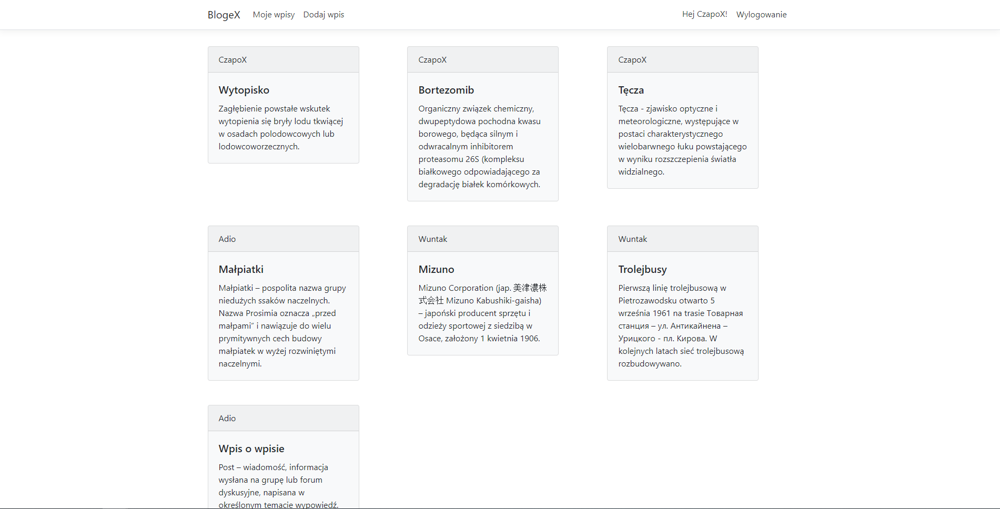
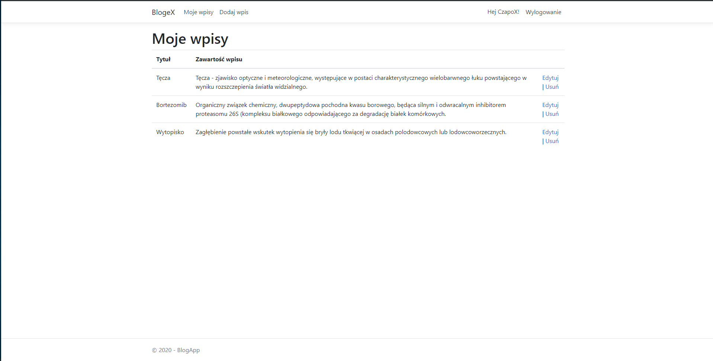
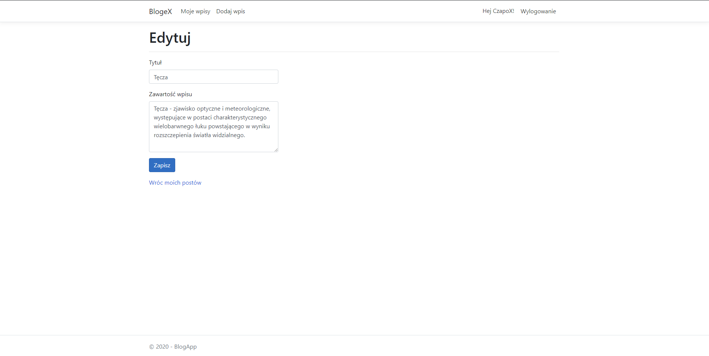
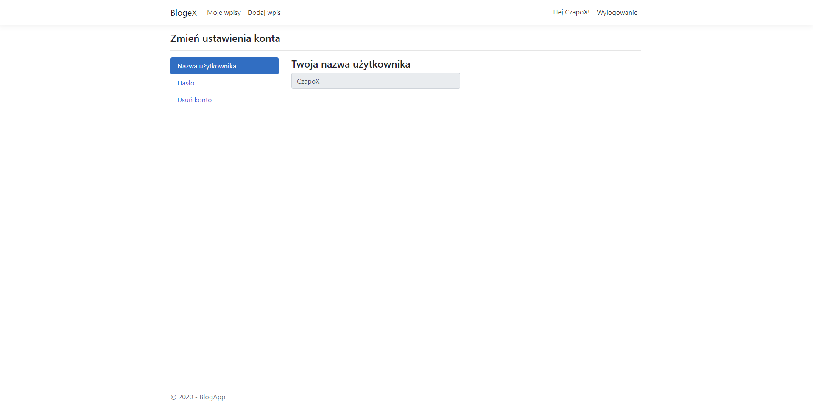

# BlogApp-MVC

Aplikacja stworzona przy użyciu:
- .NET Core
- Entity Framework
- MS SQL
- AutoMapper
- ASP.NET Core Identity

Aplikacja wyświetla posty dodane przez użytkowników platformy. Po rejestracji i zalogowaniu, użytkownik jest w stanie dodawać nowe posty oraz edytować i usuwać poprzednio stworzone przez siebie posty. Posiadana on również możliwość edytowania oraz usunięcia swojego konta. 

